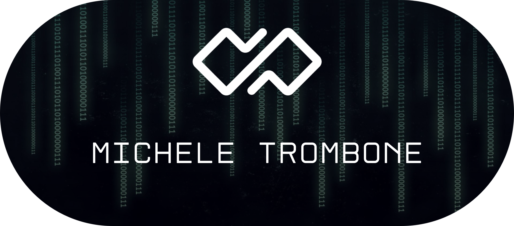
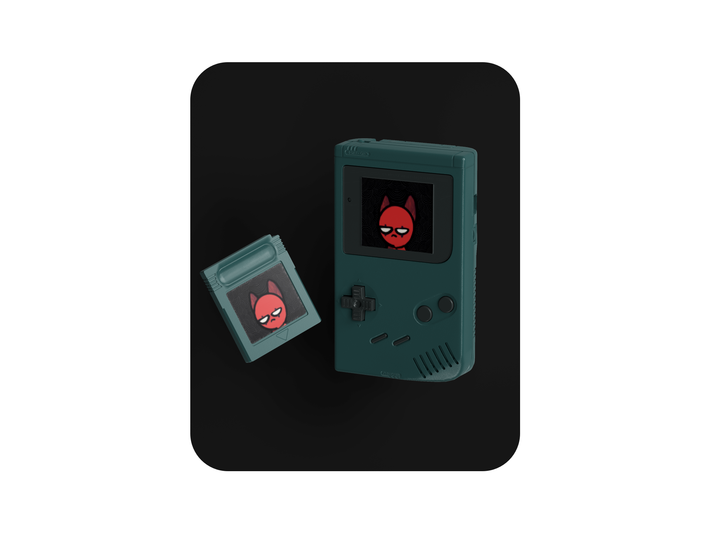
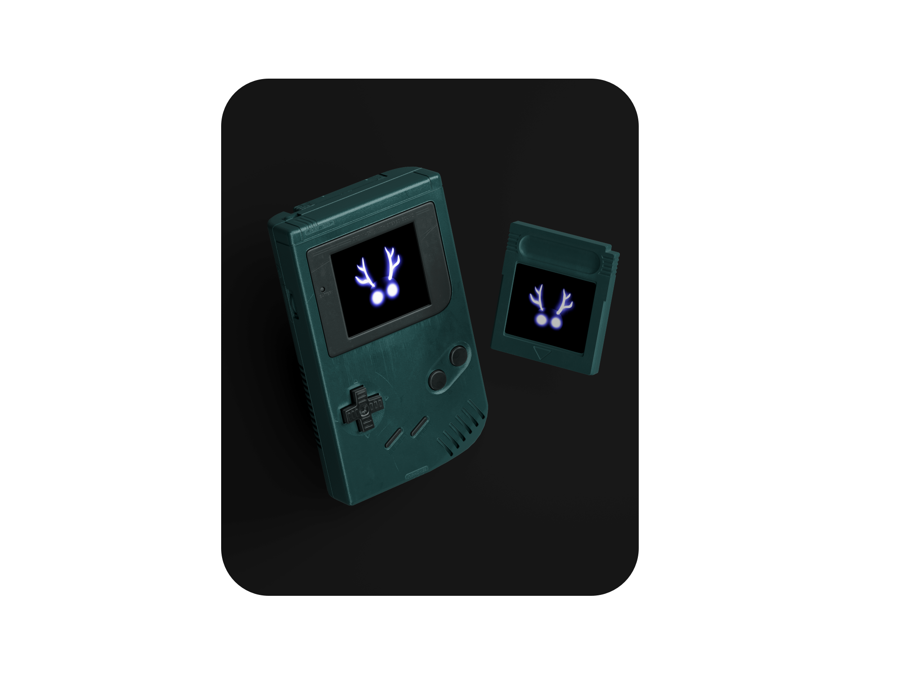

<!-- <br />
<p align="center"><a href="https://micheletrombone.netsons.org"></a></p>
<br /> -->

```bash
 ___       __   _______   ___       ________  ________  _____ ______   _______                    
|\  \     |\  \|\  ___ \ |\  \     |\   ____\|\   __  \|\   _ \  _   \|\  ___ \                   
\ \  \    \ \  \ \   __/|\ \  \    \ \  \___|\ \  \|\  \ \  \\\__\ \  \ \   __/|                  
 \ \  \  __\ \  \ \  \_|/_\ \  \    \ \  \    \ \  \\\  \ \  \\|__| \  \ \  \_|/__                
  \ \  \|\__\_\  \ \  \_|\ \ \  \____\ \  \____\ \  \\\  \ \  \    \ \  \ \  \_|\ \               
   \ \____________\ \_______\ \_______\ \_______\ \_______\ \__\    \ \__\ \_______\              
    \|____________|\|_______|\|_______|\|_______|\|_______|\|__|     \|__|\|_______|              
                                                                                                  
                                                                                                  
                                                                                                  
 _________  ________          _____ ______   ___  ________  ________  ___  ___  ___  ________     
|\___   ___\\   __  \        |\   _ \  _   \|\  \|\   ____\|\   ____\|\  \|\  \|\  \|\   __  \    
\|___ \  \_\ \  \|\  \       \ \  \\\__\ \  \ \  \ \  \___|\ \  \___|\ \  \\\  \ \  \ \  \|\  \   
     \ \  \ \ \  \\\  \       \ \  \\|__| \  \ \  \ \_____  \ \  \    \ \   __  \ \  \ \  \\\  \  
      \ \  \ \ \  \\\  \       \ \  \    \ \  \ \  \|____|\  \ \  \____\ \  \ \  \ \  \ \  \\\  \ 
       \ \__\ \ \_______\       \ \__\    \ \__\ \__\____\_\  \ \_______\ \__\ \__\ \__\ \_______\
        \|__|  \|_______|        \|__|     \|__|\|__|\_________\|_______|\|__|\|__|\|__|\|_______|
                                                    \|_________|                                  
                                                                                                  
                                                                                                  
 ________  ___  _________  ___  ___  ___  ___  ________                                           
|\   ____\|\  \|\___   ___\\  \|\  \|\  \|\  \|\   __  \                                          
\ \  \___|\ \  \|___ \  \_\ \  \\\  \ \  \\\  \ \  \|\ /_                                         
 \ \  \  __\ \  \   \ \  \ \ \   __  \ \  \\\  \ \   __  \                                        
  \ \  \|\  \ \  \   \ \  \ \ \  \ \  \ \  \\\  \ \  \|\  \                                       
   \ \_______\ \__\   \ \__\ \ \__\ \__\ \_______\ \_______\                                      
    \|_______|\|__|    \|__|  \|__|\|__|\|_______|\|_______|                                      
                                                                                                                                                    
 ```


## 💁 About Me!

Hi! I'm Michele Trombone, a developer who is passionate about technology and programming, with a special interest in the world of video games and all that surrounds it. I enjoy exploring various aspects of the industry, from game design to creating immersive experiences, including the importance of audio and music. This passion for technology drives me to seek opportunities in different fields, contributing to projects of various types.

During my studies, I acquired technical skills on various programming languages. Due to my passion for this subject, I attended several online courses on platforms such as Learnn and Udemy to broaden and deepen my skills.

During the 9-month course at the Apple Developer Academy, I specialized in game development, delving into the use of Unity and Apple frameworks, such as SpriteKit, dedicated to game development. In addition, I developed skills in creating mobile applications with Swift and SwiftUI using Xcode. The teaching methodology adopted at the Apple Developer Academy is based on Challenge-Based Learning (CBL), which allowed me to face practical challenges and learn through solving real problems.

For me, teamwork is fundamental. I have experienced this in my past jobs as well, and I believe that by collaborating we can reach our full potential in a project.

I am excited to continue to grow professionally in this fascinating and dynamic field.

## 🕹️ Games: 

### 💻  Hackathon - Mobile Game Development (bitdrome - MKERS)

<table>
<tr>
<td>

<b>ELO HELL | OCTOBER 20 - NOVEMBER 10, 2023</b><br> 
<br> 
Developed a demo of a mobile game with Unity.<br>
2D side-scrolling game with metroidvania mechanics.<br>
<b>Technologies:</b> C#, PlasticSCM, Unity Engine  

</td>
<td align="center">
<a href="https://www.foreachsoftware.it/elohell/">

</a>
</td>
</tr>
</table>

Explore the game developed for this hackathon by downloading it from the link below:

```bash
https://www.foreachsoftware.it/elohell/
```


###  Apple Developer Academy Final Project

<table>
<tr>
<td>

<b>DESTINY'S ALTERED ORDER </b><br>
<br> 
A 2D role-playing game for mobile devices developed with Unity.  
<b>Technologies:</b> C#, PlasticSCM, Unity Engine

</td>
<td align="center">
<a href="https://www.foreachsoftware.it/dao-appleacademy2023/">

</a>
</td>
</tr>
</table>

Check out the final project by downloading it from the link below:

```bash
https://www.foreachsoftware.it/dao-appleacademy2023/
```

# 💻 Tech Stack:
        	  


## 🌐 Socials:
[](https://discord.gg/michele_trombone#9380) [](https://www.instagram.com/michele_trombone/) [](https://www.linkedin.com/in/michele-trombone-470458233) [](https://medium.com/@micheletrombone) [](https://www.micheletrombone.netsons.org)
